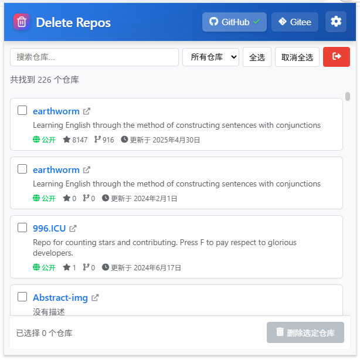

# Delete Repos

Chrome Extension for Batch Deleting GitHub/Gitee Repositories

<p align="center">English | <a href="./README.zh.md">中文</a></p>

<p align="center"></p>

## ✨ Introduction

`Delete Repos` is a Chrome extension for batch deleting repositories on GitHub or Gitee. It provides an intuitive interface to easily select and remove multiple repositories.

## 🛠️ Features

-   Supports `GitHub` and `Gitee` platforms
-   Batch delete selected repositories
-   Sleek and intuitive user interface
-   Secure Token management
-   Supports repository filtering and search
-   Responsive design, adapts to various screen sizes

### Manual Installation

1. Download the source code of this repository
2. Open Chrome and navigate to the extensions page: `chrome://extensions/`
3. Enable "Developer mode"
4. Click "Load unpacked" and select the `.output/chrome-mv3` directory

## 🌟 Usage

1. Click the Delete Repos icon in the browser toolbar
2. Select a platform (GitHub or Gitee)
3. Enter the access token (Token) for the selected platform
    - For GitHub, create it [here](https://github.com/settings/tokens/new?scopes=delete_repo,project,repo&description=deleteRepos)
    - For Gitee, create it [here](https://gitee.com/profile/personal_access_tokens/new)
4. The extension will fetch and display your repositories
5. Select repositories to delete, then click "Delete Selected Repositories"
6. Confirm to proceed with batch deletion

## ⚠️ Notes

-   **Double-check repositories before deletion**, as deleted repositories **cannot be recovered**
-   Ensure your Token has permission to delete repositories
-   For security, Tokens are only stored locally in your browser and are not transmitted elsewhere

## 🔄 Development & Build

```bash
# Install dependencies
pnpm install

# Development mode
pnpm dev

# Build the extension
pnpm build
```

## 🙌 Contribution

Contributions of any kind are welcome! If you find issues or have suggestions, please submit an Issue or Pull Request.
